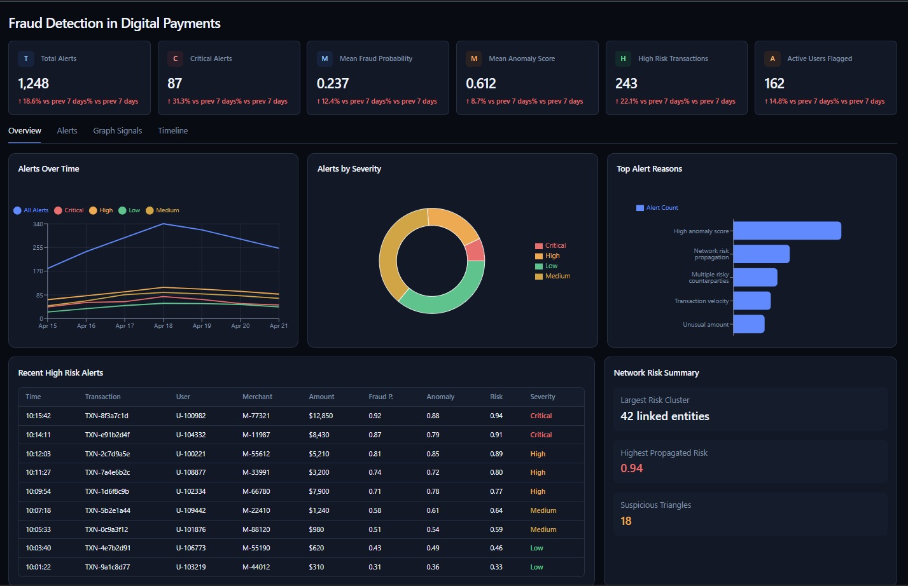
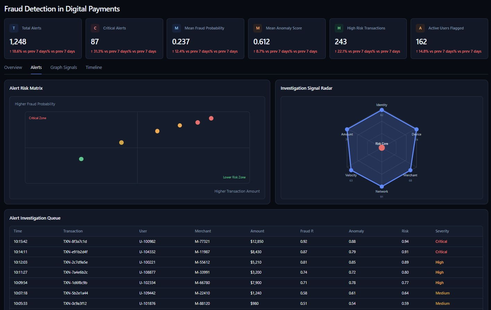
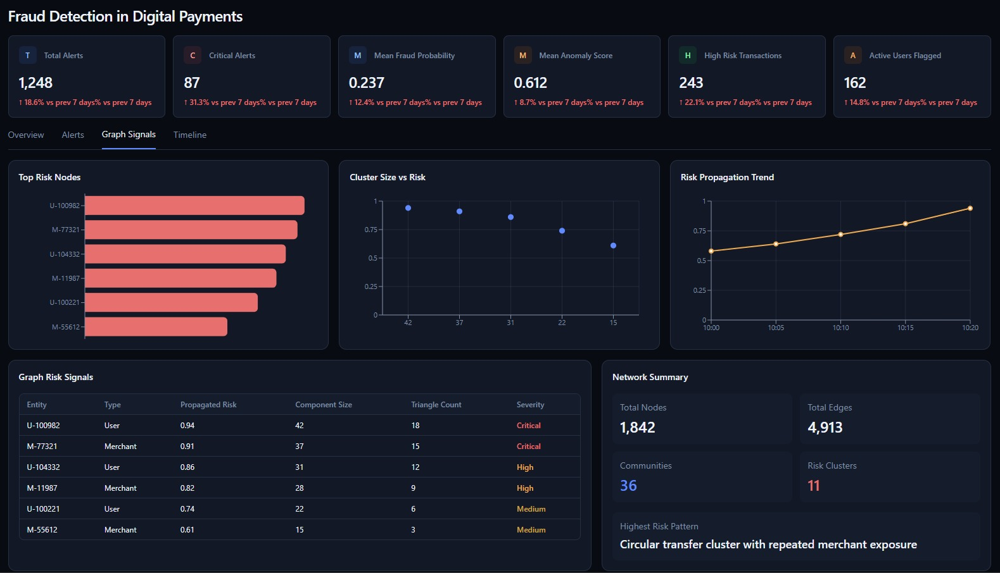
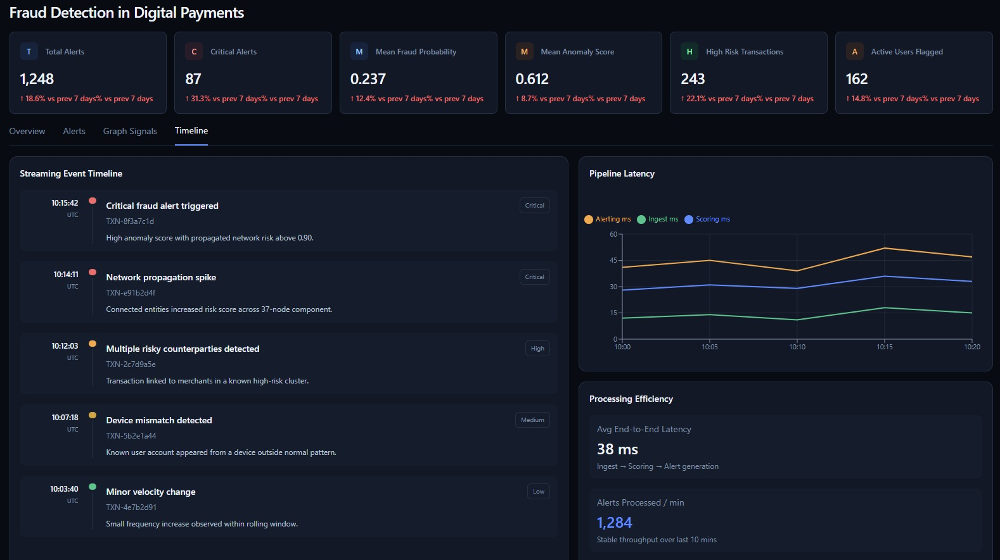

# Fraud Pattern Detection in Digital Payments

Built by two data science graduates, Mahimna Darji & Hema Manasi Potnuru. This project simulates a fraud detection system using streaming data, risk modeling, and interactive dashboards. It reflects how fraud monitoring works across transactions, networks, and alerts.

## Project Overview

Financial fraud systems need to process large volumes of transactions while identifying suspicious behavior in near real time. This project was built to:

- Simulate digital payment transactions with realistic fraud patterns  
- Process data through a streaming pipeline using Kafka and Spark  
- Detect anomalies using statistical and machine learning methods  
- Model network-based fraud patterns such as rings and burst activity  
- Present investigation workflows through an interactive dashboard  

## Authors

- Mahimna Darji  
- Hema Manasi Potnuru  

## Tech Stack

| Layer                     | Tools Used                                         |
|---------------------------|---------------------------------------------------|
| Ingestion                | Python, Kafka Producer                             |
| Streaming                | Apache Kafka                                       |
| Processing               | PySpark Structured Streaming                       |
| Validation               | Pydantic, Python                                   |
| Feature Engineering      | PySpark window functions, rolling aggregations     |
| Machine Learning         | scikit-learn, Isolation Forest, XGBoost            |
| Graph Analysis           | NetworkX                                           |
| Backend Logic            | Python                                             |
| Dashboard                | React, TypeScript, Tailwind, Recharts              |
| Storage and Artifacts    | Parquet, CSV, model artifacts                      |
| Development              | VS Code, Jupyter Notebook, Local Setup             |

## Features Built

### Streaming Pipeline
- Ingested transaction data using Kafka producers  
- Processed streams using Spark with window-based logic  
- Handled late events and ingestion delays  

### Fraud Detection Logic
- Applied anomaly detection using Isolation Forest and statistical rules  
- Calculated fraud probability and anomaly scores  
- Created risk bands based on thresholds  

### Network Pattern Detection
- Identified fraud rings and burst activity  
- Modeled relationships between entities  
- Calculated propagated risk across connected nodes  

### Dashboard
- Built a React-based investigation console  
- Displayed KPIs, alerts, and risk signals  
- Included views for alerts, graph signals, and timeline analysis  

## Sample Dashboards

| Alerts View                  | Graph Signals View            |
|------------------------------|-------------------------------|
| Alert investigation queue    | Entity-level risk signals     |
| Risk matrix for transactions | Network summary and clusters  |

| Timeline View                | Overview                      |
|-----------------------------|-------------------------------|
| Event progression and latency | KPIs and system-level metrics |

## Live Dashboard Link

## Insights Discovered

- Fraud activity often appears in short bursts rather than evenly over time  
- Network-linked entities tend to share similar risk patterns  
- High-value transactions are not always fraudulent but show higher variation  
- Certain users repeatedly interact with high-risk merchants  
- Propagated risk helps identify indirect exposure  

## Additional Analysis & Insights from Backend

### Network Risk Score

We calculated a propagated risk score across connected entities:

```
Network Risk = Base Risk + Influence from Connected High-Risk Nodes
```

This helped identify users who were not directly fraudulent but connected to suspicious clusters.

### Transaction Velocity Signal

To detect rapid activity spikes:

```
Velocity Score = Transactions per User per Time Window
```

Higher values indicated potential burst fraud behavior.

### Anomaly Score Calibration

We combined model output with statistical thresholds:

```
Final Score = Weighted (Model Score + Z-Score Features)
```

This reduced false positives while keeping high-risk cases visible.

## Graph-Based Fraud Detection

A transaction graph is built using users, accounts, merchants, and transaction relationships.

Graph features include:

- Entity graph construction  
- PageRank-based node importance  
- Community detection  
- Triangle count for circular patterns  
- Connected component detection  
- Component size  
- Graph-based risk propagation  

This helps detect fraud patterns that are not obvious from one transaction alone.

## Dashboard

The dashboard was rebuilt from scratch using React instead of Streamlit to improve layout control and visual quality.

The dashboard includes:

- Overview page  
- Alerts page  
- Graph Signals page  
- Timeline page  
- KPI cards  
- Risk charts  
- Alert investigation queue  
- Risk matrix  
- Graph signal visualizations  
- Pipeline latency view  
- Streaming event timeline

## Dashboard Images

### Overview



### Alerts



### Graph Signals



### Timeline



## Why This Project Stands Out

- Covers the full pipeline from data generation to dashboard  
- Includes both transaction-level and network-level analysis  
- Uses streaming concepts instead of static batch processing  
- Reflects how investigation workflows are handled in practice  
- Designed to be extended with real-time APIs and production systems  
